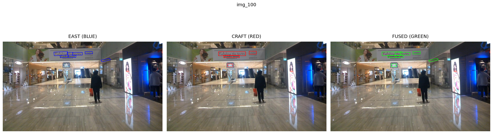

# 🔗 East and Craft Polygon Fusion Ensemble

A polygon-fusion ensemble that combines two scene-text detectors — **EAST** and **CRAFT** — to improve recall and robustness. The pipeline clusters overlapping polygons, aligns vertices, and fuses detections to reduce misses and stabilize outputs.

<p align="center">
  
</p>
<p align="center"><i>Comparison of EAST (Blue), CRAFT (Red), and Polygon Fusion (Green)</i></p>

<div align="center">
 
-  -  -  - 
</div>

---
## 🎨 Visual Results

A dedicated visual index makes it easy to inspect each image's EAST / CRAFT / FUSED outputs.

<p align="center"><i>EAST (Green)</i></p>
<p align="center">
  
</p>

---

<p align="center"><i>CRAFT (Green)</i></p>
<p align="center">
  
</p>

---

<p align="center"><i>Comparison of EAST (Blue), CRAFT (Red), and Polygon Fusion (Green)</i></p>
<p align="center">
  
</p>


---

## ✨ Key Features
- 🧭 Greedy IoU clustering of polygon detections from EAST & CRAFT  
- 🔁 Resampling & alignment to unify vertices (4-point fallback)  
- ⚖️ Weighted vertex averaging using per-model confidence and bias  
- 🛡️ Validation + safe fallbacks (convex hull / highest-confidence polygon)  
- 📊 Automated ICDAR-style evaluation and visualization exports

---

## 🚀 Quickstart (minimal)
1. Install core dependencies:
```bash
pip install shapely craft-text-detector==0.4.3 tqdm opencv-python-headless opencv-python numpy ensemble-boxes matplotlib
```
2. Configure paths in the script/notebook:
- EAST_MODEL_PATH = 'models/frozen_east_text_detection.pb'  
- CRAFT_MODEL_PATH = 'models/craft_ic15_20k.pth'  
- IMG_DIR, GT_DIR, OUTPUT_ROOT (Polygon-Fusion/outputs)
3. Run:
```bash
python run_fusion.py --img-dir test-images/ch4_test_images --output Polygon-Fusion/outputs
```

---

## 📈 Evaluation (IoU ≥ 0.5)

The table below summarizes the per-model evaluation (Precision / Recall / F1 / TP / Det / GT) and, for each metric, the best single-model baseline and the percentage change that the fusion produced relative to that baseline.

| Metric     | Best single-model baseline (model / value) | EAST | CRAFT | FUSED | Fusion vs baseline (%) |
|------------|--------------------------------------------:|:----:|:-----:|:-----:|:----------------------:|
| Precision  | CRAFT / 0.6454                              |0.6010|0.6454 |0.5811 | -9.96%                 |
| Recall     | EAST / 0.3203                               |0.3203|0.2394 |0.3924 | +22.51%                |
| F1         | EAST / 0.4179                               |0.4179|0.3492 |0.4684 | +12.10%                |
| TP (true positives) | EAST / 1675                       |1675  |1252   |2052   | +22.51%                |
| Det (detections)    | EAST / 2787                       |2787  |1940   |3531   | +26.71%                |
| GT (ground truth)   | — / 5230                           |5230  |5230   |5230   | —                      |

Notes:
- "Best single-model baseline" is the stronger individual model for that metric (between EAST and CRAFT).  
- Percentage = (FUSED − baseline) / baseline × 100. Negative percentage indicates a drop vs. the baseline.

---


## 📂 Outputs (what you'll find in OUTPUT_ROOT)
- /EAST/ — raw EAST predictions (.txt, .json)  
- /CRAFT/ — raw CRAFT predictions (.txt, .json)  
- /Fused/ — final ensembled predictions (.txt, .json)  
- /Visualization/ — side-by-side comparison images (EAST | CRAFT | FUSED) and index.html

---

## 🗂 Repository structure (trimmed)
```
|East-Craft-Fuse/
├── EAST/
│   └── east.py
├── CRAFT/
│   └── craft.py
├── Polygon-Fusion/
│   └── outputs/
│       └── Visualization/ (img_XXXX_east/craft/fused/compare + index.html)
├── poly-fusion.py
├── README.md
└── requirements.txt
```

---

## 📜 License & Citation
- License: MIT (academic). Please cite if used in research and mention any weightings or fusion modifications.

---

## ✍️ Author
Nabil Ahmed — Netaji Subhash Engineering College — B.Tech | AI & ML
